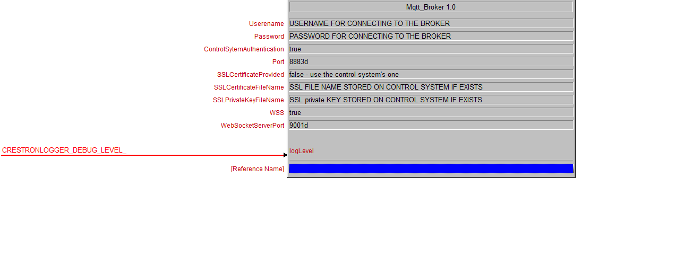

# simplewmqttbroker
A MQTT Broker module for Crestron 3-Series Control Systems written in SIMPL#

# How to use
:warning: **FOR TLS VERSION - SSL MUST BE ENABLED ON THE CONTROL SYSTEM**

Fill the information required for the connection as in the image
**THE WSS True/False choice is useless**   
**Broker doesn't support reconnection. Clients must connect with clean session true**   
**QoS 2 and 3 are not supported**

## Donation
If this module saves you time feel free to show your appreciation using the following button :D  

